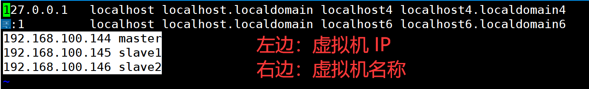
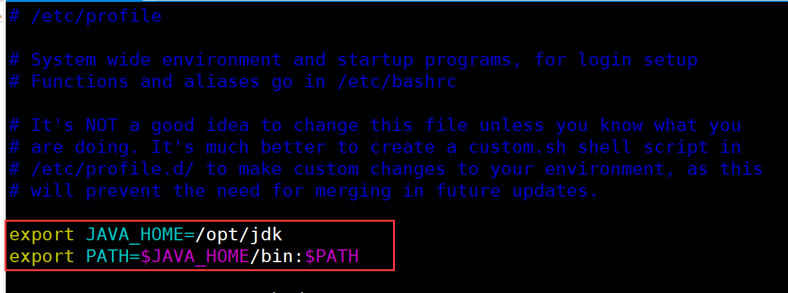
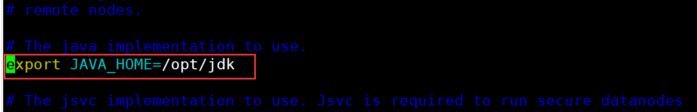
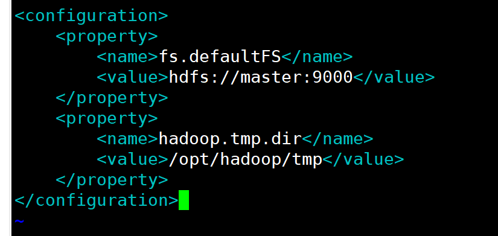

# 大数据环境搭建部分

### 注意：

- 环境搭建所需要的安装包需要提前使用 `xftp`上传，本文档默认放在虚拟机的`/root`目录下
- 环境搭建所需安装包 [下载链接](https://pan.baidu.com/s/1vk1wVTdVxyY5wuD9Q1XUvg), 提取码：`data`
- 请学会使用  `Tab` 键进行补全文件路径

#### 1、虚拟机安装

这里我们默认使用的是 `VMware 16` ，`VMware 15`也可以，`CentosOS`版本选择的是 `CentOS 7`

具体安装请看👉 [虚拟机安装CentOS 7](https://gitee.com/lazywa/BigData/blob/master/虚拟机安装CentOS7.md))

#### 2、克隆虚拟机、连接 `Xshell`

这里我们约定三台虚拟机名称默认为 `master`、`slave1`、`slave2` (比赛中会有不同的要求)

具体安装请看👉[虚拟机克隆、连接Xshell](https://gitee.com/lazywa/BigData/blob/master/虚拟机克隆、连接Xshell.md)

#### 3、关闭防火墙(三台虚拟机都要操作)

请根基你的系统版本选择对应的命令

- Centos 7 命令 (两条命令分别执行)

  ```shell
  systemctl stop firewalld.service
  systemctl disable firewalld.service
  ```

- Centos 6 命令 (两条命令分别执行)

  ```shell
  service iptables stop
  chkconfig iptables off
  ```

#### 4、修改 hosts，改完拷贝到另外两台机器

命令：

```shell
vim /etc/hosts
```

添加以下内容:

**请注意注意一下几点：**

- 主机名中**一定一定一定**不能有下划线、连接符！！！
- 请不要复制以下内容直接用，需要讲`master_ip`改成对应主机的 IP 地址(具体请看最后的示例)

- 比赛时根据官方要求统一使用 `azy01slave1`, `azy01sla` 类的名字

```shell
master_ip	master
slave1_ip	slave1
slave2_ip	slave2
```

示例：



拷贝 `hosts` 到另外两台虚拟机

命令(请**逐条在命令行中运行**)：

```shell
scp /etc/hosts slave1:/etc/hosts
scp /etc/hosts slave2:/etc/hosts
```

#### 5、配置免密登录（在 master 上）

生成 SSH 公钥(需要**按多次回车**，直到出现一个“框”)

```shell
ssh-keygen -t rsa
```

配置三台主机的免密登录(请**逐条在命令行中运行**)

```shell
ssh-copy-id -i master
ssh-copy-id -i slave2
ssh-copy-id -i slave1
```

#### 6、安装 JDK

1. 解压 `jdk` 安装包

   ```shell
   tar -zxvf jdk-8u192-linux-x64.tar.gz
   ```

2. 将解压出来的文件夹 `jdk1.8.0_192` 移动到 `/opt` 目录下，并修改文件夹名称为 `jdk`

   ```shell
   mv jdk1.8.0_192 /opt/jdk
   ```

3. 配置 `jdk` 环境变量

   命令：

   ```shell
   vim /etc/profile
   ```

   在注释的最后一行添加以下内容 (如下图)

   ```shell
   export JAVA_HOME=/opt/jdk
   export PATH=$JAVA_HOME/bin:$PATH
   ```

   

4. 显示当前环境变量(可选， 作用为备份 PATH，防止 PATH 变量受损)

   ```shell
   echo $PATH
   ```

   此时会输出一个类似以下的内容

   ```shell
   /usr/local/sbin:/usr/local/bin:/usr/sbin:/usr/bin:/root/bin
   ```

   如果环境变量配置错了，可以通过这个进行恢复

   恢复命令：

   ```shell
   export PATH=/usr/local/sbin:/usr/local/bin:/usr/sbin:/usr/bin:/root/bin
   ```

5. 使环境变量生效

   命令：

   ```shell
   source /etc/profile
   ```

   若 `source`后 `ls`、`cd`等指令没有了，可以通过上一步进行恢复，然后重新修改 `profile`文件

6. 复制环境变量到另外两台机器上((请**逐条在命令行中运行**)

   ```shell
   scp /etc/profile slave1:/etc
   scp /etc/profile slave2:/etc
   ```
   
7. 复制 `jdk` 到另外两台机器上((请**逐条在命令行中运行**)

   ```shell
   scp -r /opt/jdk slave1:/opt
   scp -r /opt/jdk slave2:/opt
   ```

#### 7、`hadoop` 配置

1. 解压 `hadoop` 安装包

   ```shell
   tar -zxvf hadoop-2.7.6.tar.gz
   ```

2. 将解压出来的文件夹 ` hadoop-2.7.6.` 移动到 `/opt` 目录下，并修改文件夹名称为 `jdk`

   ```shell
   mv hadoop-2.7.6 /opt/hadoop
   ```

3. 配置`hadoop`环境变量

   命令：`vim /etc/profile` (在刚刚配置的 `jdk` 环境变量后添加即可)

   ```shell
   export HADOOP_HOME=/opt/hadoop
   export PATH=$HADOOP_HOME/bin:$PATH
   ```
   使环境变量生效

   ```shell
   source /etc/profile
   ```

4. 复制环境变量到另外两台机器上((请**逐条在命令行中运行**)

   ```shell
   scp /etc/profile slave1:/etc
   scp /etc/profile slave2:/etc
   ```
   
5. 修改 `hadoop` 的配置文件

   1. 进入 `hadoop` 配置文件的文件夹

      ```shell
      cd /opt/hadoop/etc/hadoop
      ```

   2. 修改 `slaves `

      命令：

      ```shell
      vim slaves
      ```

      删除里面的 `localhost`，添加以下内容

      ```
      slave1
      slave2
      ```

   3. 修改 `hadoop-env.sh`

      命令：

      ```shell
      vim hadoop-env.sh
      ```

      将 `JAVA_HOME` 修改成

      ```shell
      export JAVA_HOME=/opt/jdk
      ```

      

   4. 需改 `core-site.xml`

      命令：

      ```shell
      vim core-site.xml
      ```

      添加以下内容：(一定要在 <configuration> </configuration> 之间添加)

      ```xml
      <property>
          <name>fs.defaultFS</name>
          <value>hdfs://master:9000</value>
      </property>
      
      <property>
          <name>hadoop.tmp.dir</name>
          <value>/opt/hadoop/tmp</value>
      </property>
      ```

      

   5. 修改 `hdfs-site.xml`

      命令：

      ```shell
      vim hdfs-site.xml
      ```

      添加以下内容：(一定要在 <configuration> </configuration> 之间添加)

      ```xml
      <property>
          <name>dfs.replication</name>
          <value>1</value>
      </property>
      ```

   6. 修改 `mapred-site.xml`

      - 从 `mapred-site.xml.template`复制出 `mapred-site.xml`

        命令：

       ```shell
       cp mapred-site.xml.template mapred-site.xml
       ```

       - 用 `vim ` 编辑

         命令：

         ```
         vim mapred-site.xml
         ```

         添加以下内容：(一定要在 <configuration> </configuration> 之间添加)

         ```xml
         <property>
             <name>mapreduce.framework.name</name>
             <value>yarn</value>
         </property>
         ```

   7. 修改 `yarn-site.xml`

       命令：

       ```shell
       vim yarn-site.xml
       ```

       添加以下内容：(一定要在 <configuration> </configuration> 之间添加)

       ```xml
       <property>
           <name>yarn.resourcemanager.hostname</name>
           <value>master</value>
       </property>

       <property>
           <name>yarn.nodemanager.aux-services</name>
           <value>mapreduce_shuffle</value>
       </property>
       ```

6. 把 `hadoop` 拷到其他机器上(请**逐条在命令行中运行**)

    ```shell
    scp -r /opt/hadoop slave1:/opt/
    scp -r /opt/hadoop slave2:/opt/
    ```

7. 在 master 上初始化 `hadoop` 集群

    ```shell
    hadoop namenode -format
    ```

8. 启动节点

   - 进入 `hadoop` 的 `sbin` 文件夹

     ```shell
     cd /opt/hadoop/sbin
     ```

   - 启动 `hadoop`

     ```shell
     ./start-all.sh
     ```

9. 使用 `jps` 命令查看进程

   ```shell
   jps
   ```

   若 `master` 显示 

   ```shell
   Namenode
   Resourcemanager
   SecondaryNameNode
   Jps
   ```

   `slave1`、`slave2`显示：

   ```shell
   Datanode
   Nodemanager
   Jps
   ```

   则安装成功，否则安装失败，请检查上述步骤或者配置文件是否出错

#### 8、MySQL

1. 因为 `CentOS 7` 默认安装了 `mariadb-libs` 会导致安装不上 `MySQL` 所以先卸载冲突源

    ```shell
    rpm -e --nodeps mariadb-libs
    ```
    
2. 使用 `rpm` 包安装(先安装 `MySQL-client` 再安装 `MySQL-server`，一条条执行)

    ```shell
    rpm -ivh MySQL-client-5.1.73-1.glibc23.x86_64.rpm
    rpm -ivh MySQL-server-5.1.73-1.glibc23.x86_64.rpm
    ```

3. 启动 `mysql` 服务(安装好 `server` 后一般会自启动，不需要手动启动，可以省略)

    ```shell
    service mysql start
    ```

4. 加入到开机启动项

    ```shell
    chkconfig mysql on
    ```

5. 初始化配置 `mysql` 服务

    ```shell
    mysql_secure_installation
    ```

    - `Enter current password for root (enter for none):` ：直接按回车

    - `Set root password? [Y/n]`：输入 `Y`
    - `New password:`： 输入 `123456`
    - `Re-enter new password:`：再输入 `123456`
    - 后面全部回车即可

6. 登录 MySQL(密码是：`123456`)

    ```shell
    mysql -uroot -p
    ```

7. 设置用户权限(请**逐条在 SQL 命令行中运行**)

    ```sql
    use mysql;
    update user set host='%' where user = 'root';
    flush privileges;
    ```

9. 建 `hive` 表

   ```sql
   create database hive default charset utf8;
   ```

10. 检查表是否创建成功

    ```sql
    show databases;
    ```

11. 退出 `MySQL`

    ```
    exit;
    ```

12. `MySQL` 配置的疑难解答

- 检查 `service mysql status`，如果在非启动状态有锁住，直接删去锁文件（`status` 上会指定路径）。

- `mysql` 可能会出现启动不完全的情况。`ps -aux | ps -ef` 检查所有 `mysql` 服务的进程号，`kill -9` 杀死 `mysql` 的所有进程重新启动。

#### 9、hive 配置文件

1. `hive-env.sh`（`hive-env.sh.template` -> `hive-env.sh`）

   ```sh
   HADOOP_HOME=/opt/hadoop
   JAVA_HOME=/opt/jdk
   HIVE_HOME=/opt/hive
   ```

2. `hive-site.xml`（从 `hive-default.xml.template` 拷贝）

   ```
   " vim 配置方便查找（选择配置）
   set ignorecase " 自动跳到第一个匹配的结果
   set incsearch  " 搜索时忽略大小写
   ```

   ```xml
   <!-- vim使用`/`加关键字搜索，n切换到下一个搜索项，N切换到上一个搜索项 -->
   <property>
      <name>javax.jdo.option.ConnectionURL </name> 
      <value>jdbc:mysql://主机ip(不要使用hosts):3306/hive?useSSL=false</value> 
   </property>
   
   <property> 
      <name>javax.jdo.option.ConnectionDriverName </name> 
      <value>com.mysql.jdbc.Driver </value> 
   </property> 
   
   <property>
      <name>javax.jdo.option.ConnectionUserName</name>
      <value>root</value>
   </property> 
   
   <property> 
      <name>javax.jdo.option.ConnectionPassword </name> 
      <value>123456</value> 
   </property>
   
   <property>
      <name>hive.querylog.location</name>
   <value>/opt/hive/tmp</value>
   </property>
   
   <property>
      <name>hive.exec.local.scratchdir</name>
   <value>/opt/hive/tmp</value>
   </property>
   
   <property>
       <name>hive.downloaded.resources.dir</name>
       <value>/opt/hive/tmp</value>
   </property>
   ```

```shell
# 提供 mysql-connector jar包
cp /root/mysql-connector-java-5.1.17-bin.jar /opt/hive/lib/

# 替换掉 hadoop 的 jline 的版本 (高版本的似乎不自带 jline, 目前只知道 hadoop1.6 需要先删除 jline-0.9.94.jar)
rm -rf /opt/hadoop/share/hadoop/yarn/lib/jline-0.9.94.jar
cp /opt/hive/lib/jline-2.12.jar /opt/hadoop/share/hadoop/yarn/lib/
```

**拷贝配置文件到所有机器上**

```shell
scp -r /opt/hive slave1:/opt
scp -r /opt/hive slave2:/opt
```

**初始化元数据：**

```shell
schematool -dbType mysql -initSchema
```

**启动 hive，查看是否运行正常**

```sql
show databases;
set hive.cli.print.current.db=true;
exit;
```

**hadoop 退出 safe mode**

```bash
hadoop dfsadmin -safemode leave
```

**hdfs-site.xml的一些配置**

```
设置dfs权限打开 				truedfs.permissions
设置HDFS数据块的备份数		  dfs.replication 
设置数据块写入的最多重试次数 	   dfs.client.block.write.retries
设置dfs最大并发对象数          dfs.max.objects
设置DateNode启动的服务线程数   dfs.datanode.handler.count
```

**hdfs dfs的一些指令，其实跟 bash 的指令差不多：**

```shell
-ls
-mkdir [-p]
-touchz  (跟bash的touch是一样的)
-rmr
-appendToFile File1 File2   (追加File1到File2尾部)
-chmod 644 File1
-cat
-put

# 上传命令：hdfs dfs -put 本地文件路径 hdfs的路径
hdfs dfs -put /usr/local/testdata/anhui.txt /data/

# 下载命令：上传命令：hdfs dfs -get  hdfs的路径 本地文件路径
hdfs dfs -get /data/anhui.txt /usr/local/
```

<p style="color:grey">HDFS 传输问题优先考虑防火墙的问题，优先先尝试关闭防火墙（但实际比赛环境好像没有防火墙）</p>

HDFS 报错：  
`appendToFile: Failed to APPEND_FILE /data/file/data1.csv for DFSClient_NONMAPREDUCE_-1657827142_1 on 192.168.1.100 because lease recovery is in progress. Try again later.`
在 `hdfs-site.xml` 中追加 `name: dfs.client.block.write.replace-datanode-on-failure.policy value=NEVER`

#### 10、zookeeper

**配置环境变量**

```shell
ZOOKEEPER_HOME=/opt/zookeeper
export PATH=$ZOOKEEPER_HOME/bin:$PATH
```

**修改配置文件**

`zoo.cfg`（从 `zoo_sample.cfg` 复制）

```cfg
dataDir=/opt/zookeeper/data
server.0=master:2888:3888
server.1=slave1:2888:3888
server.2=slave2:2888:3888
```

**同步到其它节点**

```shell
scp -r /opt/zookeeper slave1:/opt
scp -r /opt/zookeeper slave2:/opt
```

**创建 `/opt/zookeepe/data` 目录(每台机器都需要配置)**

```shell
mkdir /opt/zookeeper/data

# 在 data 目录下创建 myid 文件
vim myid
# 分别加上0, 1, 2
# master -> 0
# slave1  -> 1
# slave2  -> 2
```

**启动 zookeeper**

```shell
# 三台都需要执行
zkServer.sh start

# 查看状态
zkServer.sh status

# 当有一个 leader 的时候启动成功

# 连接 zookeeper
zkCli.sh

# zk shell 操作
ls /                  查找根目录
create /test abc      创建节点并赋值
get /test             获取指定节点的值
set /test cb          设置已存在节点的值
rmr /test             递归删除节点
delete /test/test01   删除不存在子节点的节点
```

#### 11、hbase 配置文件

1. hbase-env.sh

   ```sh
   # 1、改JAVA_HOME
   
   # 2.1、未安装 zookeeper
   	export HBASE_MANAGES_ZK=true
   # 2.2、安装 zookeeper
   	export HBASE_MANAGES_ZK=false
   # 这个关系到 HMaster 的启动
   ```

2. hbase-site.xml

   ```xml
   <property> 
   	<name>hbase.rootdir</name>
       <value>hdfs://matser/hbase</value>
   </property>
   
   <property> 
       <name>hbase.cluster.distributed</name>
       <value>true</value> 
   </property> 
   
   <property> 
       <name>hbase.zookeeper.quorum</name>
       <value>master,slave1,slave2</value>
   </property>
   
   # 装了 zookeeper 则不需要此配置
   <property>
      <name>hbase.zookeeper.property.dataDir</name> 
      <value>/opt/hbase/zookeeper</value>
   </property>
   ```

3. regionservers

   ```
   slave1
   slave2
   ```

**拷贝配置文件到所有机器上**

```shell
scp -r /opt/hbase node1:/opt
scp -r /opt/hbase node2:/opt
```

**启动 hbase**

```shell
./start-hbase.sh

# 进入 hbase sell
hbase shell
```

在master、slave2、slave3中的任意一台机器使用`./bin/hbase shell `进入hbase自带的shell环境，然后使用命令`version`等，进行查看hbase信息及建立表等操作

**关闭安全模式**

```shell
hadoop dfsadmin -safemode leave
```

主节点: 

1. HMaster

2. HQuorumPeer

子节点: 

1. HRegionServer

2. HQuorumPeer

**hadoop配置的疑难解答**

*namenode 没有启动成功：*

查看 namenode 的日志。根据实际情况随机应变。

大部分情况尝试删除 hadoop 的 tmp 目录，解决 namenode 启动故障。

从节点的 NodeManager 没有启动，尝试将 hadoop 的配置文件拷出，重新解压安装 hadoop 重新初始化。

**注意 hadoop 拷贝到其他从节点在初始化 namenode 之前。**

#### 12、Spark

**配置环境变量**

```shell
export SPARK_HOME=/opt/spark
export PATH=$SPARK_HOME/bin:$PATH
```

**修改配置文件**  
1. **`spark-env.sh`(从 `spark-env.sh.template` 复制)**

   ```shell
   export SPARK_MASTER_IP=master
   export SPARK_MASTER_PORT=7077
   export SPARK_WORKER_CORES=1  // 根据虚拟机情况设置
   export SPARK_WORKER_INSTANCES=1
   export SPARK_WORKER_MEMORY=1g // 根据虚拟机情况设置
   export HADOOP_CONF_DIR=/opt/hadoop/etc/hadoop
   export JAVA_HOME=/opt/jdk
   ```

2. **`slaves`(从 `slaves.template` 复制)**

   ```
   slave1
   slave2
   ```

**拷贝配置文件到所有机器上**

```shell
scp -r /opt/spark slave1:/opt
scp -r /opt/spark slave2:/opt
```

**启动 Spark**

```shell
./sbin/start-all.sh

# 访问 Spark UI
http://master:8080
```

**往 yarn 提交任务需要增加两个配置(`/opt/hadoop/etc/hadoop/yarn-site.xml`)**

```xml
<property>
    <name>yarn.nodemanager.pmem-check-enabled</name>
    <value>false</value>
</property>

<property>
    <name>yarn.nodemanager.vmem-check-enabled</name>
    <value>false</value>
</property>
```

**同步到其他节点，重启 yarn**

```shell
scp -r /opt/hadoop/etc/hadoop/yarn-site.xml slave1:`pwd`
scp -r /opt/hadoop/etc/hadoop/yarn-site.xml slave2:`pwd`

/opt/hadoop/sbin/stop-yarn.sh
/opt/hadoop/sbin/start-yarn.sh
```

#### 13、Python

**安装编译所需的环境(在`tensorflow_torch.tgz`内)**

```shell
tar -zxvf tensorflow_torch.tgz
cd tensorflow_torch/rpm
rpm -ivh --nodeps --force *.rpm
```

**编译安装**

```shell
tar -zxvf Python-3.6.3.tgz
cd Python-3.6.3
./configure --prefix=/opt/python36

make

# make 结束后进行
make install
```

**创建软链接**

```shell
ln -s /opt/python36/bin/python3 /usr/bin/python3
ln -s /opt/python36/bin/pip3 /usr/bin/pip3
```

**升级 pip**

```shell
cd /root/tensorflow_torch
pip3 install pip-20.2.3-py2.py3-none-any.whl
```

**安装 Tensorflow**

```shell
# numpy-1.17.2-cp36-cp36m-manylinux1_x86_64.whl
# protobuf-3.9.2-cp36-cp36m-manylinux1_x86_64.whl
# requirements.txt
# six-1.12.0-py2.py3-none-any.whl
# tensorflow-1.1.0rc1-cp36-cp36m-manylinux1_x86_64.whl
# Werkzeug-0.16.0-py2.py3-none-any.whl
# wheel-0.33.6-py2.py3-none-any.whl
cd /root/tensorflow_torch/tensorflow
pip3 install *.whl
```

**Tensorflow 测试代码**

```python
import tensorflow as tf
sess = tf.Session()
hello = tf.constant('Hello,world!')
print(sess.run(hello))
```

**安装 PyTorch**

```shell
cd /root/tensorflow_torch/pytorch
# 安装 future(要需要先安装，不然后面会报错)
tar zxvf future-0.18.2.tar.gz
cd future-0.18.2
python3 setup.py install

# 安装其他
# Pillow-7.2.0-cp36-cp36m-manylinux1_x86_64.whl
# torch-1.6.0+cpu-cp36-cp36m-linux_x86_64.whl
# torchvision-0.7.0+cpu-cp36-cp36m-linux_x86_64.whl
cd ..
pip3 install *.whl
```

**PyTorch 测试代码**

```python
import torch
print(torch.__version__)
print(torch.tensor([1, 2]))
```

**排错**

```shell
python3.6: error while loading shared libraries: libpython3.6m.so.1.0:cannot open shared object file: No such file or directory

# 使用命令ldd /usr/local/Python-3.6/bin/python3 检查其动态链接
```

```shell
# 拷贝文件到lib库
cd /root/Python-3.6.5
cp libpython3.6m.so.1.0 /usr/local/lib64/
cp libpython3.6m.so.1.0 /usr/lib/
cp libpython3.6m.so.1.0 /usr/lib64/
```

**有网络情况下的安装**

```
yum install python3
pip3 install --upgrade pip
pip3 install tensorflow
pip3 install torch
```

**修改 pip 源**

pip 默认源下载很慢所以建议修改成国内镜像源

1. 手动修改

   - 在 `~/`目录下新建 `.pip`文件夹: 

   ```skell
   mkdir ~/.pip
   ```

   - 在 `~/.pip`文件夹下新建 `pip.conf`写入以下内容：`vim ~/.pip/pip.conf`

   ```
   [global]
   index-url = http://pypi.douban.com/simple/
   [install]
   trusted-host = pypi.douban.com
   ```

2. 使用 `pqi` 修改

   ```shell
   pip3 install pqi
   
   pqi ls
   pypi 	 https://pypi.python.org/simple/
   tuna 	 https://pypi.tuna.tsinghua.edu.cn/simple
   douban 	 http://pypi.douban.com/simple/
   aliyun 	 https://mirrors.aliyun.com/pypi/simple/
   ustc 	 https://mirrors.ustc.edu.cn/pypi/web/simple
   
   pqi use <name> # <name> 为以上显示源的名称，建议使用 ustc 或 douban
   ```

   
