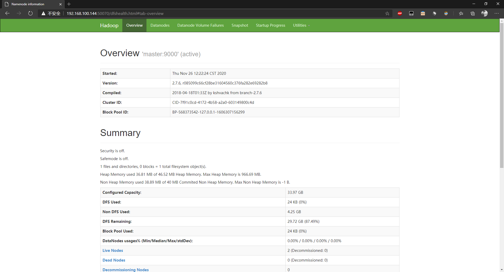
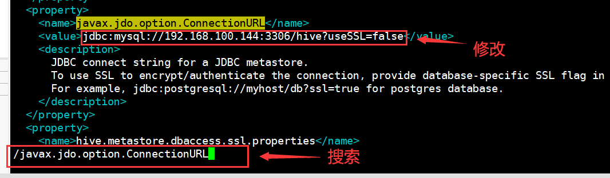
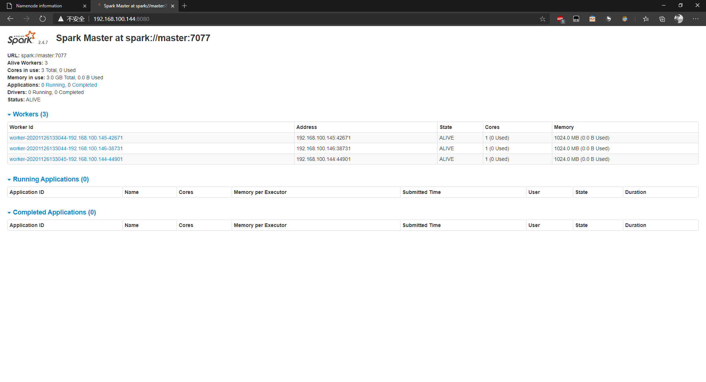
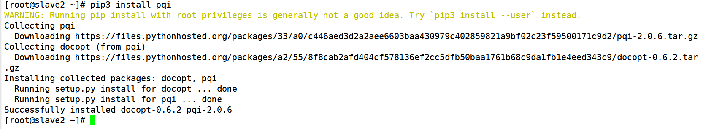

# 大数据环境搭建部分

### 注意：

- 环境搭建所需要的安装包需要提前使用 `xftp`上传，本文档默认放在虚拟机的`/root`目录下
- 环境搭建所需安装包 [下载链接](https://pan.baidu.com/s/1vk1wVTdVxyY5wuD9Q1XUvg), 提取码：`data`
- 请学会使用  `Tab` 键进行补全文件路径

#### 1、虚拟机安装

这里我们默认使用的是 `VMware 16` ，`VMware 15`也可以，`CentosOS`版本选择的是 `CentOS 7`

具体安装请看👉 [虚拟机安装CentOS 7](https://gitee.com/lazywa/BigData/blob/master/虚拟机安装CentOS7.md)

#### 2、克隆虚拟机、连接 `Xshell`

这里我们约定三台虚拟机名称默认为 `master`、`slave1`、`slave2` (比赛中会有不同的要求)

具体安装请看👉[虚拟机克隆、连接Xshell](https://gitee.com/lazywa/BigData/blob/master/虚拟机克隆、连接Xshell.md)

#### 3、关闭防火墙(三台虚拟机都要操作)

请根基你的系统版本选择对应的命令

- Centos 7 命令 (两条命令分别执行)

  ```shell
  systemctl stop firewalld.service
  systemctl disable firewalld.service
  ```

- Centos 6 命令 (两条命令分别执行)

  ```shell
  service iptables stop
  chkconfig iptables off
  ```

#### 4、修改 hosts，改完拷贝到另外两台机器

命令：

```shell
vim /etc/hosts
```

添加以下内容:

**请注意注意以下几点：**

- 主机名中**一定一定一定**不能有下划线、连接符！！！
- 请不要复制以下内容直接用，需要将`master_ip`改成对应主机的 IP 地址(具体请看最后的示例)

- 比赛时根据官方要求统一使用 `azy01slave1`, `azy01sla` 类的名字

```shell
master_ip	master
slave1_ip	slave1
slave2_ip	slave2
```

示例：


拷贝 `hosts` 到另外两台虚拟机

命令(请**逐条在命令行中运行**)：

```shell
scp /etc/hosts slave1:/etc/hosts
scp /etc/hosts slave2:/etc/hosts
```

#### 5、配置免密登录（在 master 上）

生成 SSH 公钥(需要**按多次回车**，直到出现一个“框”)

```shell
ssh-keygen -t rsa
```

配置三台主机的免密登录(请**逐条在命令行中运行**，后面的主机名称根据大家在 `hosts` 里的配置填写)

```shell
ssh-copy-id -i master
ssh-copy-id -i slave2
ssh-copy-id -i slave1
```

#### 6、安装 JDK

1. 解压 `jdk` 安装包

   ```shell
   tar -zxvf jdk-8u192-linux-x64.tar.gz
   ```

2. 将解压出来的文件夹 `jdk1.8.0_192` 移动到 `/opt` 目录下，并修改文件夹名称为 `jdk`

   可以先使用 `ls` 命令查看解压出来的文件夹名称，可能与文档有差异，请按自己解压出来的**文件夹名称**操作

   ```shell
   mv jdk1.8.0_192 /opt/jdk
   ```

3. 配置 `jdk` 环境变量

   命令：

   ```shell
   vim /etc/profile
   ```

   在注释的最后一行添加以下内容 (如下图)

   ```shell
   export JAVA_HOME=/opt/jdk
   export PATH=$JAVA_HOME/bin:$PATH
   ```

   

4. 显示当前环境变量(可选，作用为备份 PATH，防止 PATH 变量受损，无法恢复)

   ```shell
   echo $PATH
   ```

   此时会输出一个类似以下的内容

   ```shell
   /usr/local/sbin:/usr/local/bin:/usr/sbin:/usr/bin:/root/bin
   ```

   如果环境变量配置错了，可以通过这个进行恢复

   恢复命令：

   ```shell
   export PATH=/usr/local/sbin:/usr/local/bin:/usr/sbin:/usr/bin:/root/bin
   ```

5. 使环境变量生效

   命令：

   ```shell
   source /etc/profile
   ```

   若 `source`后 `ls`、`cd`等指令没有了，可以通过上一步进行恢复，然后重新修改 `profile`文件

6. 复制环境变量到另外两台机器上((请**逐条在命令行中运行**)

   ```shell
   scp /etc/profile slave1:/etc
   scp /etc/profile slave2:/etc
   ```

7. 复制 `jdk` 到另外两台机器上((请**逐条在命令行中运行**)

   ```shell
   scp -r /opt/jdk slave1:/opt
   scp -r /opt/jdk slave2:/opt
   ```

#### 7、`hadoop` 配置

1. 解压 `hadoop` 安装包

   ```shell
   tar -zxvf hadoop-2.7.6.tar.gz
   ```

2. 将解压出来的文件夹 ` hadoop-2.7.6.` 移动到 `/opt` 目录下，并修改文件夹名称为 `hadoop`

   ```shell
   mv hadoop-2.7.6 /opt/hadoop
   ```

3. 配置`hadoop`环境变量

   命令：`vim /etc/profile` (在刚刚配置的 `jdk` 环境变量后添加即可)

   ```shell
   export HADOOP_HOME=/opt/hadoop
   export PATH=$HADOOP_HOME/bin:$PATH
   ```
   使环境变量生效

   ```shell
   source /etc/profile
   ```

4. 复制环境变量到另外两台机器上((请**逐条在命令行中运行**)

   ```shell
   scp /etc/profile slave1:/etc
   scp /etc/profile slave2:/etc
   ```
   
5. 修改 `hadoop` 的配置文件

   1. 进入 `hadoop` 配置文件的文件夹

      ```shell
      cd /opt/hadoop/etc/hadoop
      ```

   2. 修改 `slaves `

      命令：

      ```shell
      vim slaves
      ```

      先删除里面的 `localhost`，然后添加以下内容

      ```
      slave1
      slave2
      ```

   3. 修改 `hadoop-env.sh`

      命令：

      ```shell
      vim hadoop-env.sh
      ```

      将 `JAVA_HOME` 修改成

      ```shell
      export JAVA_HOME=/opt/jdk
      ```

      

   4. 修改 `core-site.xml`

      命令：

      ```shell
      vim core-site.xml
      ```

      添加以下内容：(一定要在 `<configuration> </configuration>` 之间添加)

      ```xml
      <property>
          <name>fs.defaultFS</name>
          <value>hdfs://master:9000</value>
      </property>
      
      <property>
          <name>hadoop.tmp.dir</name>
          <value>/opt/hadoop/tmp</value>
      </property>
      ```

      

   5. 修改 `hdfs-site.xml`

      命令：

      ```shell
      vim hdfs-site.xml
      ```

      添加以下内容：(一定要在 `<configuration> </configuration>` 之间添加)

      ```xml
      <property>
          <name>dfs.replication</name>
          <value>1</value>
      </property>
      ```

   6. 修改 `mapred-site.xml`

      - 从 `mapred-site.xml.template`复制出 `mapred-site.xml`

        命令：
      
        ```shell
        cp mapred-site.xml.template mapred-site.xml
        ```

       - 用 `vim ` 编辑

         命令：

         ```
         vim mapred-site.xml
         ```

         添加以下内容：(一定要在 `<configuration> </configuration>` 之间添加)

         ```xml
         <property>
             <name>mapreduce.framework.name</name>
             <value>yarn</value>
         </property>
         ```

   7. 修改 `yarn-site.xml`

       命令：

       ```shell
       vim yarn-site.xml
       ```

       添加以下内容：(一定要在 `<configuration> </configuration>` 之间添加)

       ```xml
       <property>
           <name>yarn.resourcemanager.hostname</name>
           <value>master</value>
       </property>

       <property>
           <name>yarn.nodemanager.aux-services</name>
           <value>mapreduce_shuffle</value>
       </property>
       ```

6. 把 `hadoop` 拷到其他机器上(请**逐条在命令行中运行**)

    ```shell
    scp -r /opt/hadoop slave1:/opt/
    scp -r /opt/hadoop slave2:/opt/
    ```

7. 在 master 上初始化 `hadoop` 集群

    ```shell
    hadoop namenode -format
    ```

8. 启动节点

   - 进入 `hadoop` 的 `sbin` 文件夹

     ```shell
     cd /opt/hadoop/sbin
     ```

   - 启动 `hadoop`

     ```shell
     ./start-all.sh
     ```

9. 使用 `jps` 命令查看进程启动情况

   ```shell
   jps
   ```

   若 `master` 显示 

   ```shell
   Namenode
   Resourcemanager
   SecondaryNameNode
   Jps
   ```

   `slave1`、`slave2`显示：

   ```shell
   Datanode
   Nodemanager
   Jps
   ```

   则安装成功，否则安装失败，请检查上述步骤或者配置文件是否出错

10. `hadoop` 配置的疑难解答

    - `namenode` 没有启动成功：

      查看`namenode`的日志。根据实际情况随机应变。

      大部分情况尝试删除 `hadoop`的 `tmp` 目录，解决`namenode` 启动故障。

    - 从节点的 `NodeManage`r 没有启动

      尝试将 `hadoop` 的配置文件拷出，重新解压安装 `hadoop` 重新初始化。

    **注意 `hadoop` 拷贝到其他从节点在初始化 `namenode` 之前。**

11. 安装成功后可以打开浏览器，输入网址 `master` 的 `IP` + `:50070`(注意是英文的 `:`)

     example

     ```
     192.168.100.144:50070
     ```

     

#### 8、MySQL

1. 因为 `CentOS 7` 默认安装了 `mariadb-libs` 会导致安装不上 `MySQL` 所以先卸载冲突源

    ```shell
    rpm -e --nodeps mariadb-libs
    ```
    
2. 使用 `rpm` 包安装(先安装 `MySQL-client` 再安装 `MySQL-server`，一条条执行)

    ```shell
    rpm -ivh MySQL-client-5.1.73-1.glibc23.x86_64.rpm
    rpm -ivh MySQL-server-5.1.73-1.glibc23.x86_64.rpm
    ```

3. 启动 `mysql` 服务(安装好 `server` 后一般会自启动，不需要手动启动，可以省略)

    ```shell
    service mysql start
    ```

4. 加入到开机启动项

    ```shell
    chkconfig mysql on
    ```

5. 初始化配置 `mysql` 服务

    ```shell
    mysql_secure_installation
    ```

    - `Enter current password for root (enter for none):` ：直接按回车

    - `Set root password? [Y/n]`：输入 `Y`
    - `New password:`： 输入 `123456`
    - `Re-enter new password:`：再输入 `123456`
    - 后面全部回车即可

6. 登录 MySQL(密码是：`123456`)

    ```shell
    mysql -uroot -p
    ```

7. 设置用户权限(请**逐条在 SQL 命令行中运行**)

    ```sql
    use mysql;
    update user set host='%' where user = 'root';
    -- 注意上面一行执行完之后必定会报错，如 ERROR 1062 (23000): Duplicate entry '%-root' for key 'PRIMARY'
    -- 直接无视执行下一句
    flush privileges;
    ```

9. 建 `hive` 表

   ```sql
   create database hive default charset utf8;
   ```

10. 检查表是否创建成功

    ```sql
    show databases;
    ```

11. 退出 `MySQL`

    ```sql
    exit;
    ```

12. `MySQL` 配置的疑难解答

- 检查 `service mysql status`，如果在非启动状态有锁住，直接删去锁文件（`status` 上会指定路径）。

- `mysql` 可能会出现启动不完全的情况。`ps -aux | ps -ef` 检查所有 `mysql` 服务的进程号，`kill -9` 杀死 `mysql` 的所有进程重新启动。

#### 9、hive 配置文件

1. 解压 `hive` 安装包

   ```shell
   tar -zxvf apache-hive-2.2.0-bin.tar.gz
   ```

2. 将解压出来的文件夹 ` hadoop-2.7.6.` 移动到 `/opt` 目录下，并修改文件夹名称为 `hive`

   ```shell
   mv apache-hive-2.2.0-bin /opt/hive
   ```

3. 配置 `hive` 的环境变量

   命令：

   ```shell
   vim /etc/profile
   ```

   在 `hadoop` 环境变量后添加以下内容

   ```shell
   export HIVE_HOME=/opt/hive
   export PATH=$HIVE_HOME/bin:$PATH
   ```

   使环境变量生效

   ```shell
   source /etc/profile
   ```

4. 修改 `hive` 的配置文件

   1. 进入 `hive` 配置文件目录

      ```shell
      cd /opt/hive/conf
      ```

   2. 修改 `hive-env.sh`

      - 从模板中拷贝`hive-env.sh`

        ```shell
        cp hive-env.sh.template hive-env.sh
        ```

      - 编辑 `hive-env.sh`

        ```shell
        vim hive-env.sh
        ```

        添加以下内容

        ```shell
        HADOOP_HOME=/opt/hadoop
        JAVA_HOME=/opt/jdk
        HIVE_HOME=/opt/hive
        ```

        

   3. 修改 `hive-site.xml`

      - 从模板中拷贝`hive-site.xml`(注意文件名称不同)

        ```shell
        cp hive-default.xml.template hive-site.xml
        ```

      - 配置 `vim` (可选)

        为了方便查找需要修改的内容可以进行一些 `vim` 的配置

        命令：

        ```shell
        vim ~/.vimrc
        ```

        添加以下内容

        ```shell
        set ignorecase " 自动跳到第一个匹配的结果
        set incsearch  " 搜索时忽略大小写
        ```

      - 修改  `hive-site.xml` 内容

        命令：

        ```shell
        vim hive-site.xml
        ```

        按 `/` 搜索 以下 `<name></name>` 内的内容，修改对应 `<value></value>` 内的内容

        修改一条后按 `Esc` **退出编辑模式**进行下一次搜索！！！

        ```xml
        <property>
           <name>javax.jdo.option.ConnectionURL</name> 
           <value>jdbc:mysql://虚拟机ip(不要使用hosts):3306/hive?useSSL=false</value> 
        </property>
        
        <property> 
           <name>javax.jdo.option.ConnectionDriverName </name> 
           <value>com.mysql.jdbc.Driver </value> 
        </property> 
        
        <property>
           <name>javax.jdo.option.ConnectionUserName</name>
           <value>root</value>
        </property> 
        
        <property> 
           <name>javax.jdo.option.ConnectionPassword </name> 
           <value>123456</value> 
        </property>
        
        <property>
           <name>hive.querylog.location</name>
        <value>/opt/hive/tmp</value>
        </property>
        
        <property>
           <name>hive.exec.local.scratchdir</name>
        <value>/opt/hive/tmp</value>
        </property>
        
        <property>
            <name>hive.downloaded.resources.dir</name>
            <value>/opt/hive/tmp</value>
        </property>
        ```

        example:

        

5. 将 `MySQL` 驱动 `jar` 包拷贝到 `hive `(这里使用的是 `5.1.17` 版本)

   ```shell
   cp /root/mysql-connector-java-5.1.17-bin.jar /opt/hive/lib/
   ```

6. 替换掉 `hadoop` 的 `jline` 的版本，使用 `hive` 的 `2,12` 版本

   ```shell
   cp /opt/hive/lib/jline-2.12.jar /opt/hadoop/share/hadoop/yarn/lib/
   ```

   **注意：** 如果安装的是 `hadoop1.6` 版本，则需要先删除自带的 `0.9.94` 版本的 `jline`

   ```shell
   rm -rf /opt/hadoop/share/hadoop/yarn/lib/jline-0.9.94.jar
   ```

7. 拷贝配置文件到另外两台虚拟机

   ```shell
   scp -r /opt/hive slave1:/opt
   scp -r /opt/hive slave2:/opt
   ```

8. 在 `master` 上初始化元数据

   ```shell
   schematool -dbType mysql -initSchema
   ```

9. 启动 `hive`

   ```
   hive
   ```

   若出现以下内容 `hive` 启动成功，否则安装失败，请检查以上步骤是否出错

   ```hive
   hive>
   ```

10. `hive` 的基本操作

    查看数据库

    ```sql
    show databases;
    ```

    显示使用的数据库名称

    ```sql
    set hive.cli.print.current.db=true;
    ```

    退出

    ```sql
    exit;
    ```

11. `hadoop` 退出 `safe mode`(可以不做这一步)

    ```shell
    hadoop dfsadmin -safemode leave
    ```

12. `hdfs-site.xml` 的一些配置详情(了解)

    ```shell
    truedfs.permissions					设置dfs权限打开
    dfs.replication						设置HDFS数据块的备份数
    dfs.client.block.write.retries		设置数据块写入的最多重试次数
    dfs.max.objects						设置dfs最大并发对象数
    dfs.datanode.handler.count			设置DateNode启动的服务线程数
    ```

13. `hdfs dfs` 的一些指令(实跟 bash 的指令差不多，掌握)

    ```shell
    hdfs dfs -ls							(显示 hdfs 指定路径下的文件)
    hdfs dfs -mkdir [-p]					(在 hdfs 上创建文件夹)
    hdfs dfs -touchz  						(在 hdfs 上创建文件，与 bash 的 touch 相同)
    hdfs dfs -rm -r							(删除 hdfs 上的文件)
    hdfs dfs -appendToFile File1 File2   	(追加 File1 到 File2 尾部)
    hdfs dfs -chmod 644 File1				(修改 hdfs 上指定文件或文件夹的权限)
    hdfs dfs -cat							(显示 hdfs 上指定文件的内容)
    hdfs dfs -put							(上传文件到 hdfs 上)
    
    # 上传命令：hdfs dfs -put 本地文件路径 hdfs路径
    hdfs dfs -put /usr/local/testdata/anhui.txt /data/
    
    # 下载命令：上传命令：hdfs dfs -get  hdfs路径 本地文件路径
    hdfs dfs -get /data/anhui.txt /usr/local/
    ```

14. `hdfs` 一些问题解决

    - 第一步检查虚拟机防火墙是否关闭

      HDFS 传输问题优先考虑防火墙的问题，优先先尝试关闭防火墙（但实际比赛环境好像没有防火墙）

    - 报错 `appendToFile: Failed to APPEND_FILE /data/file/data1.csv for DFSClient_NONMAPREDUCE_-1657827142_1 on 192.168.1.100 because lease recovery is in progress. Try again later.`

      在 `hdfs-site.xml` 中追加 `name: dfs.client.block.write.replace-datanode-on-failure.policy value=NEVER`

#### 10、zookeeper(了解，不需要安装)

1. 解压、移动到 `/opt` 下

   同 `hadoop` 略

2. 配置环境变量(配置好记得 `source /etc/profile`)

   ```shell
   ZOOKEEPER_HOME=/opt/zookeeper
   export PATH=$ZOOKEEPER_HOME/bin:$PATH
   ```

2. 修改配置文件(配置文件在 `/opt/zookeeper/conf/` 目录下)

   - `zoo.cfg`（从 `zoo_sample.cfg` 复制）

     ```
     dataDir=/opt/zookeeper/data
     server.0=master:2888:3888
     server.1=slave1:2888:3888
     server.2=slave2:2888:3888
     ```

3. 同步到其它节点

   ```shell
   scp -r /opt/zookeeper slave1:/opt
   scp -r /opt/zookeeper slave2:/opt
   ```

4. 创建 `/opt/zookeepe/data` 目录(三机器都需要配置)

   ```
   mkdir /opt/zookeeper/data
   ```

   分别在每台虚拟机下操作：

   1. 在 `data` 目录下创建 `myid` 文件

   2. 三台虚拟机分别在 `myid` 文件内填入 `0, 1, 2` (根据 `zoo.cfg` 中一一对应)

      ```shell
      master 填入 0
      slave1 填入 1
      slave2 填入 2
      ```

5. 启动 `zookeeper` (三台虚拟机都要操作)

   ```shell
   zkServer.sh start
   ```

6. `zookeeper` 一些其他的指令

   查看状态

   ```shell
   zkServer.sh status
   ```

   当有一个 `leader` 的时候启动成功，连接 `zookeeper`

   ```shell
   zkCli.sh
   ```

   `zk shel` 操作

   ```shell
   ls /                  查找根目录
   create /test abc      创建节点并赋值
   get /test             获取指定节点的值
   set /test cb          设置已存在节点的值
   rmr /test             递归删除节点
   delete /test/test01   删除不存在子节点的节点
   ```

#### 11、`hbase` 配置文件

1. 解压、移动到 `/opt` 下

   同 `hadoop` 略

2. 配置环境变量 (配置好记得 `source /etc/profile`)

   ```shell
   export HBASE_HOME=/opt/hbase
   export PATH=$HBASE_HOME/bin:$PATH
   ```

3. 修改配置文件(配置文件在 `/opt/hbase/conf/` 目录下)
   1. 修改 `hbase-env.sh`

      添加以下内容

      ```shell
      export JAVA_HOME=/opt/jdk
      export HBASE_MANAGES_ZK=true
      ```

      

   2. 修改 `hbase-site.xml` (在 `<configuration></configuration>` 之间加入以下内容)

      ```xml
      <property> 
      	<name>hbase.rootdir</name>
          <value>hdfs://matser:9000/hbase</value>
      </property>
      
      <property> 
          <name>hbase.cluster.distributed</name>
          <value>true</value> 
      </property> 
      
      <property> 
          <name>hbase.zookeeper.quorum</name>
          <value>master,slave1,slave2</value>
      </property>
      
      <property>
         <name>hbase.zookeeper.property.dataDir</name> 
         <value>/opt/hbase/zookeeper</value>
      </property>
      ```

      

4. 修改 `regionservers` 删除 `localhost` 添加以下内容

   ```shell
   slave1
   slave2
   ```

5. 拷贝配置文件到所有机器上

   ```shell
   scp -r /opt/hbase slave1:/opt
   scp -r /opt/hbase slave2:/opt
   ```

6. 启动 `hbase`

   ```shell
   start-hbase.sh
   ```

7. 进入 `hbase sell`

   ```shell
   hbase shell
   ```

   在`master`、`slave1`、`slave2 `中的任意一台机器进入 `hbase` 自带的`shell`环境，然后使用命令 `version` 等，进行查看 `hbase` 信息及建立表等操作

8. `jps` 查看进程

   master

   ```
   HMaster
   HQuorumPeer
   ```

   slave

   ```
   HRegionServer
   HQuorumPeer
   ```

#### 12、Spark

1. 解压、移动到 `/opt` 下

   同 `hadoop` 略

2. 配置环境变量 (配置好记得 `source /etc/profile`)

   ```shell
   export SPARK_HOME=/opt/spark
   export PATH=$SPARK_HOME/bin:$PATH
   ```

3. 修改配置文件(配置文件在 `/opt/spark/conf/` 目录下)

4. `spark-env.sh`(从 `spark-env.sh.template` 复制，添加以下内容)

   **注意：`SPARK_WORKER_CORES` 和 `SPARK_WORKER_MEMORY` 请根据虚拟机情况设置**

   ```shell
   export SPARK_MASTER_IP=master
   export SPARK_MASTER_PORT=7077
   export SPARK_WORKER_CORES=1
   export SPARK_WORKER_INSTANCES=1
   export SPARK_WORKER_MEMORY=1g
   export HADOOP_CONF_DIR=/opt/hadoop/etc/hadoop
   export JAVA_HOME=/opt/jdk
   ```

5. `slaves`(从 `slaves.template` 复制，添加以下内容，不用删除 `localhosts`)

   ```
   slave1
   slave2
   ```

6. 拷贝配置文件到所有机器上

   ```shell
   scp -r /opt/spark slave1:/opt
   scp -r /opt/spark slave2:/opt
   ```

7. 启动 `Spark`

   ```shell
   cd /opt/spark/sbin
   ./start-all.sh
   ```

8. `jps`查看进程

   `master`

   ```
   Master
   Worker
   ```

   `slave`

   ```
   Worker
   ```

9. 访问 `Spark UI`

   同 `hadoop`，`ip` 地址为 `master` 的 `ip` 地址

   ```
   http://192.168.100.144:8080
   ```

   

10. 往 yarn 提交任务需要增加两个配置(`/opt/hadoop/etc/hadoop/yarn-site.xml`)

   ```xml
   <property>
       <name>yarn.nodemanager.pmem-check-enabled</name>
       <value>false</value>
   </property>
   
   <property>
       <name>yarn.nodemanager.vmem-check-enabled</name>
       <value>false</value>
   </property>
   ```

   同步到其他节点

   ```shell
   scp -r /opt/hadoop/etc/hadoop/yarn-site.xml slave1:/opt/hadoop/etc/hadoop/
   scp -r /opt/hadoop/etc/hadoop/yarn-site.xml slave2:/opt/hadoop/etc/hadoop/
   ```

   重启 `yarn`

   ```shell
   ./opt/hadoop/sbin/stop-yarn.sh
   ./opt/hadoop/sbin/start-yarn.sh
   ```

#### 13、Python

**注意：** 以下 `Python 3` 的安装依赖于 `tensorflow_torch.tgz` 内的文件，请回到最上方点击链接进行下载

1. 安装编译所需的环境

   逐条在命令行执行

   ```shell
   tar -zxvf tensorflow_torch.tgz
   cd tensorflow_torch/rpm
   rpm -ivh --nodeps --force *.rpm
   ```

2. 编译 `Python` ，安装

   解压

   ```shell
   tar -zxvf Python-3.6.3.tgz
   ```

   进入 `Python-3.6.3` 文件夹

   ```shell
   cd Python-3.6.3
   ```

   编译安装(逐条在命令行执行)

   ```shell
   ./configure --prefix=/opt/python36
   make
   make install
   ```

3. 创建软链接

   ```
   ln -s /opt/python36/bin/python3 /usr/bin/python3
   ln -s /opt/python36/bin/pip3 /usr/bin/pip3
   ```

4. 升级 pip

   ```shell
   cd /root/tensorflow_torch
   pip3 install pip-20.2.3-py2.py3-none-any.whl
   ```

   

5. 安装 `Tensorflow`(逐条执行最后两行)

   ```shell
   # numpy-1.17.2-cp36-cp36m-manylinux1_x86_64.whl
   # protobuf-3.9.2-cp36-cp36m-manylinux1_x86_64.whl
   # requirements.txt
   # six-1.12.0-py2.py3-none-any.whl
   # tensorflow-1.1.0rc1-cp36-cp36m-manylinux1_x86_64.whl
   # Werkzeug-0.16.0-py2.py3-none-any.whl
   # wheel-0.33.6-py2.py3-none-any.whl
   cd /root/tensorflow_torch/tensorflow
   pip3 install *.whl
   ```

   `Tensorflow` 测试代码(`Python3` 环境下运行)

   ```python
   import tensorflow as tf
   sess = tf.Session()
   hello = tf.constant('Hello,world!')
   print(sess.run(hello))
   ```

6. 安装 `PyTorch`

   ```shell
   cd /root/tensorflow_torch/pytorch
   # 安装 future(要需要先安装，不然后面会报错)
   tar zxvf future-0.18.2.tar.gz
   cd future-0.18.2
   python3 setup.py install
   
   # 安装其他
   # Pillow-7.2.0-cp36-cp36m-manylinux1_x86_64.whl
   # torch-1.6.0+cpu-cp36-cp36m-linux_x86_64.whl
   # torchvision-0.7.0+cpu-cp36-cp36m-linux_x86_64.whl
   cd ..
   pip3 install *.whl
   ```

   `PyTorch` 测试代码

   ```python
   import torch
   print(torch.__version__)
   print(torch.tensor([1, 2]))
   ```

7. 排错

   - `python3.6: error while loading shared libraries: libpython3.6m.so.1.0:cannot open shared object file: No such file or directory`

     使用命令 `ldd /usr/local/Python-3.6/bin/python3` 检查其动态链接

     拷贝文件到 `lib` 库

     ```shell
     cd /root/Python-3.6.5
     cp libpython3.6m.so.1.0 /usr/local/lib64/
     cp libpython3.6m.so.1.0 /usr/lib/
     cp libpython3.6m.so.1.0 /usr/lib64/
     ```

8. 有网络情况下的安装(执行完第二条命令后，请看第 9 步)

   ```shell
   yum install python3
   pip3 install --upgrade pip
   pip3 install tensorflow
   pip3 install torch
   ```

9. 修改 pip 源

   `pip` 默认源下载很慢所以建议修改成国内镜像源(**以下方法任选其一**)

   1. 手动修改

      - 在 `~/`目录下新建 `.pip`文件夹: 

        ```shell
        mkdir ~/.pip
        ```

      - 在 `~/.pip`文件夹下新建 `pip.conf`写入以下内容：`vim ~/.pip/pip.conf`

        ```conf
        [global]
        index-url = http://pypi.douban.com/simple/
        [install]
        trusted-host = pypi.douban.com
        ```

   2. 使用 `pqi` 修改

      ```shell
      pip3 install pqi
      pqi ls
      pqi use <name> # <name> 为以上显示源的名称，建议使用 ustc 或 douban
      ```

      

      

      