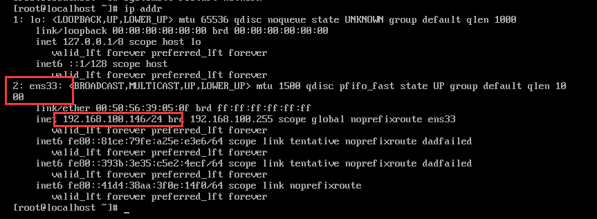
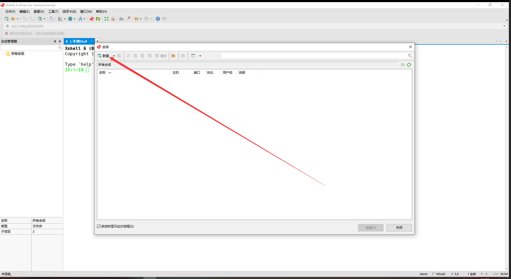

#### 1、克隆虚拟机

关闭虚拟机(一定要关机，否则无法克隆)

右键点击 **master -> 管理 -> 克隆**


下一步


这里一定要**选择创建完整！！！**


改个名字叫做 slave1，位置随意，然后点击完成，等待克隆结束


同样的方法再克隆一台虚拟机 slave2


**注意！！！**

在开机前需要修改一下 slave1 和 slave2 的 mac 地址，操作如下

点击**网络适配置 -> 高级 -> 生成**，前面框内会重新生成一个 mac 地址，然后点击确定即可(**slave1 和 slave2 都要操作**)


开启三台虚拟机

由于第一步创建 CentOS 7 时，设置的是静态 IP 所以现在三台虚拟机的 I P地址是相同的，但是在同一个网络下不允许有相同的 IP 地址，所以现在需要修改一下 slave1 和 slave2 的 IP

登录 slave1 和 slave2 虚拟机

输入以下命令进入ens33网卡的配置

```shell
vi /etc/sysconfig/network-scripts/ifcfg-ens33
```

slave1：修改 IPADDR 后的IP地址 192.168.100.144 改为 192.168.100.145

slave1：修改 IPADDR 后的IP地址 192.168.100.144 改为 192.168.100.146

大家根据自己电脑的 IP 进行修改，切勿直接使用本教程的 IP

(修改最后一位使得三个虚拟机的IP的最后一位不同即可，前三位保持不变)


保存退出后重启一下网卡即可

重启网卡命令：

```shell
systemctl restart network
```

重启网卡成功后可用 `ip addr` 命令查看  IP

master


slave1


slave2



#### 2、使用 Xshell 链接三台虚拟机

新建会话：



名称填虚拟机的名称(方便识别是那一台虚拟机，是什么不重要)，IP 填写对应虚拟机的 IP


点击用户身份验证

用户名：root

密码：123456

完成后点击连接


SSH安全警告**选择接受并保存**


这样就 master 就连接成功了


同样的方法连接 slave1 和 slave2


三台虚拟机都连接成功

