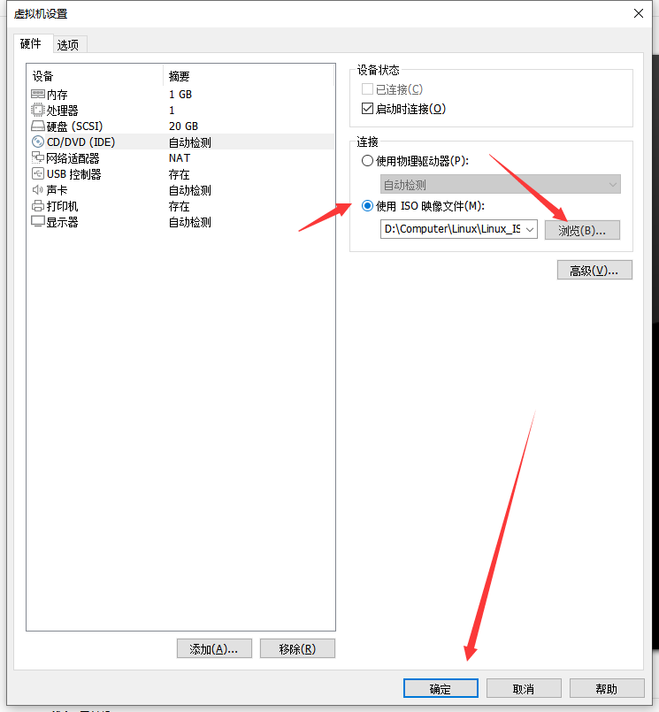
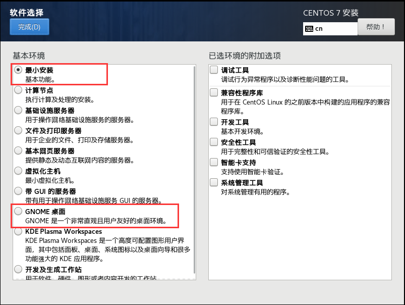

#### CentOS 7 安装

打开VMware，进入主界面后点击**创建新虚拟机**按钮

选择典型，点击下一步

选择稍后安装操作系统

客户机操作系统选择 `Linux`，版本选择`CentOS 7 64 位`

虚拟机名称`master`，位置自行选择

默认20G大小不需要调整，直接下一步即可

完成新建虚拟机向导

点击`CD/DVD(IDE)`选择使用 ISO 镜像，浏览选择我们下载的`CentOS-7-x86_64-DVD-2003.iso`镜像

开启虚拟机进行安装配置 (这里说明一下，单击一下是进入虚拟机里，上下键可以选择，`Enter `键是确定，`Ctr + Alt` 是退出虚拟机系统），选择 `Install CentOS 7` ,然后回车)

选择安装过程使用哪种语言，可以设置为中文，继续。

软件选择：这里全部默认就行

如果电脑配置不错可以在软件选择勾选**GNOME桌面**，电脑配置低的话建议使用默认的**最小安装**(无桌面环境)

安装位置点进去后直接点击完成即可，无需配置

网络和主机名配置

- 在此进行网络配置后，不需要再手动修改`ifcfg-ens33`的配置，减少人为发生错误的概率

打开网卡开关会自动生成一个 IP 地址

点击**配置**，点击 **IPV4 设置**，将方法中的**自动**改为**手动**

点击 **add** 参考刚刚自动生成的 **IP 地址、子网掩码、默认路由、DNS**进行填写，然后保存、完成

(**注意：**一定要根据之前生成的信息配置，切勿按照本教程图中的信息进行配置！！！)

最后点击开始安装

设置root密码：这里统一都设置为123456，方便后续的安装

创建用户：用户名随意，密码也统一设置为 123456

等待安装完成后重启虚拟机即可

重启后登录 CentOS 7

- localhost login：root
- Password：123456 (不会显示出来，输入完回车即可)

